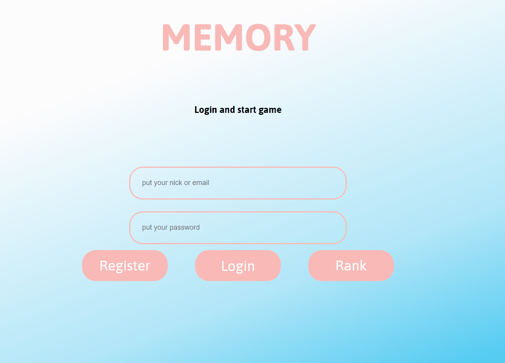
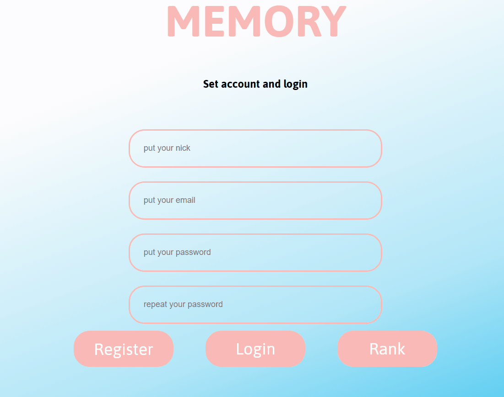
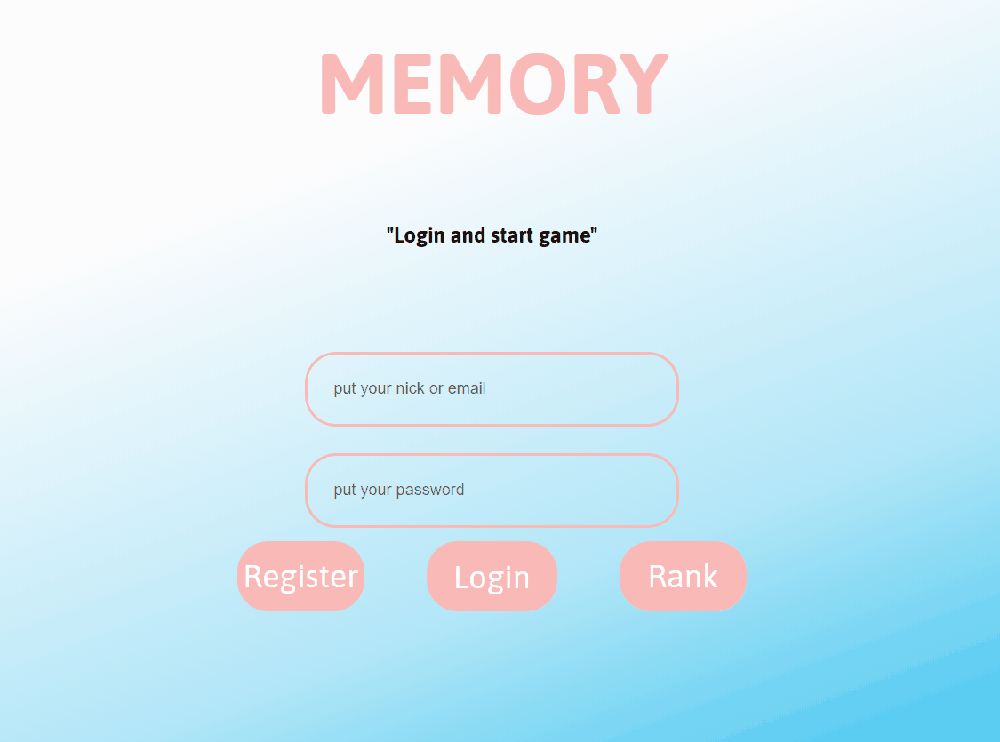
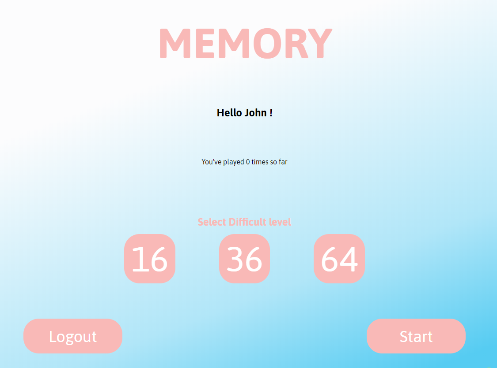
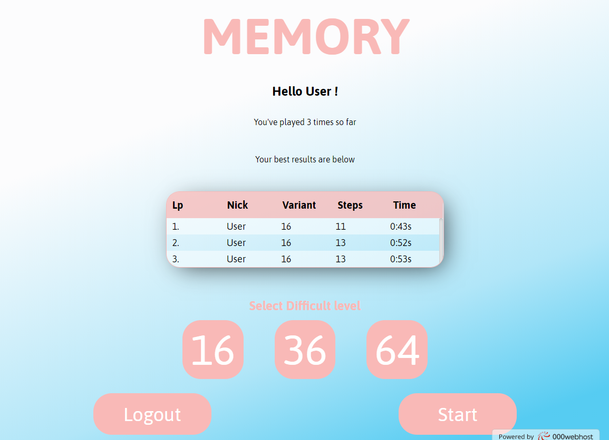
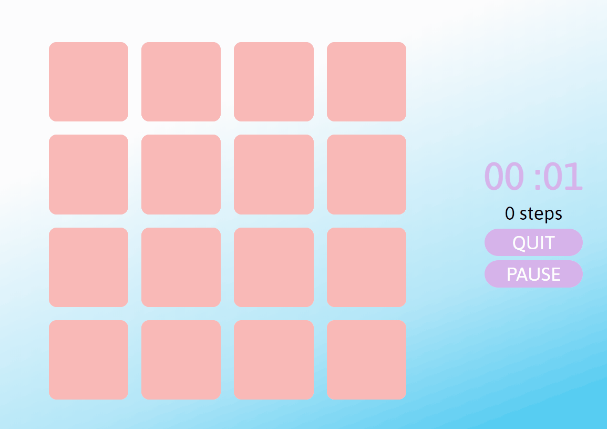
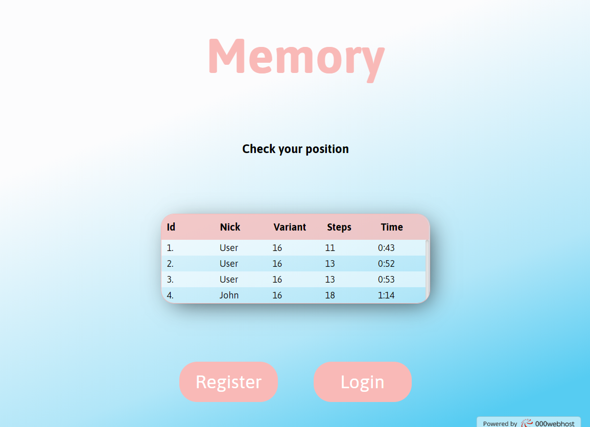

# MEMORY app

Aplikacja webowa popularnej gry MEMORY.
Celem gry jest odnalezienie wszystkich par takich samych kart, przy możliwie najmniejszej liczbie odsłon i jak najkrótszym czasie.
Przygotowane są 3 poziomy trudności.

## Demo aplikacji:

[wfrud.pl](https://wfrud.000webhostapp.com/memory/) 
Login: User 
Hasło: User12345

### Użyte technologie

### Opis i Prezentacja

Memory app składa się z 5 komponentów widoku:

- Rejestracja,
- Logowanie,
- Panel Użytkownika,
- Plansza Gry,
- Ranking

## _1.Rejestracja_

W celu rejestracji należy wypełnić formularz, który jest walidowany po stronie klienta z pomocą wyrażen regularnych, tak aby zapobiec wysłaniu formularza z pustym lub źle wypełnionym polem. 
Po wciśnieciu przycisku "Register", formularz jest wysyłany za pomocą biblioteki Axios do bazy danych, gdzie po stronie serwera skrypt PHP sprawdza ponownie poprawność wypełnioncyh pól oraz czy istnieje już User o podanym nicku.

Informacja o istniejącym koncie zawierającym taki sam nick lub email zostaje zwrócona przez serwer i wyświetlona pod odpowiednim inputem.
Jeżeli formularz został zwalidowany poprawnie na podstawie odpowiedzi z serwera User zostaje przeniesiony do widoku Login z pomocą React Router.

## _2.Logowanie_

Formularz logowania jest walidowany aby zapobiec wysłaniu pustych pól, w przypadku nie podania nicku lub hasła, bądź wpisania niepoprawnego loginu lub hasła zostaje zwrócona informacja z serwera i wyświetlona pod inputem.  W momencie poprawnego zalogowania się do aplikacji, user zostaje przeniesiony do widoku użytkownika. 

## _3.Panel uzytkownika_

Panel użytkownika zawiera 3 dostępne warianty rozgrywki.

Jeżeli nie jest to pierwsza rozgrywka, wyświetlana jest tabela z wynikami.

Po wybraniu odpowiedniego wariantu i wciśnięciu przycisku start, użytkownik zostaje przeniesiony do planszy gry.

## _4.Plansza Gry_

Komponent planszy gry składa się z dwóch subkomponentów:

- Planszy,
- Menu rozgrywki

Wielkość planszy renderowana jest na podstawie wybranego wariantu gry. Menu Rozgrywki składa się z Timera i Licznika ruchów oraz dwóch buttonów wyjścia i pauzy.
Użytkownik klikając na wybrany kafelek odsłania obrazek, klikając na kolejny próbuje odnaleźć podobny obrazek. Jeżeli obrazki nie pasują po 2 sekundach zostają ponownie zasłonięte.

Gra kończy się w momencie odsłonięcia wszystkich kafelków, o czym gracz zostaje poinformowanych wyskakującym okienkiem push-up zawierającym czas oraz liczbę kroków.

## _5.Ranking_

Komponent ma na celu zaprezentowanie wyników wszystkich graczy, zaraz po wyrenderowaniu komponent za pomocą hooka useEffect() wysyła zapytanie do serwera, zwrócone dane są posortowane rozsnąco wg. czasu i zaprezentowane w tabeli.

